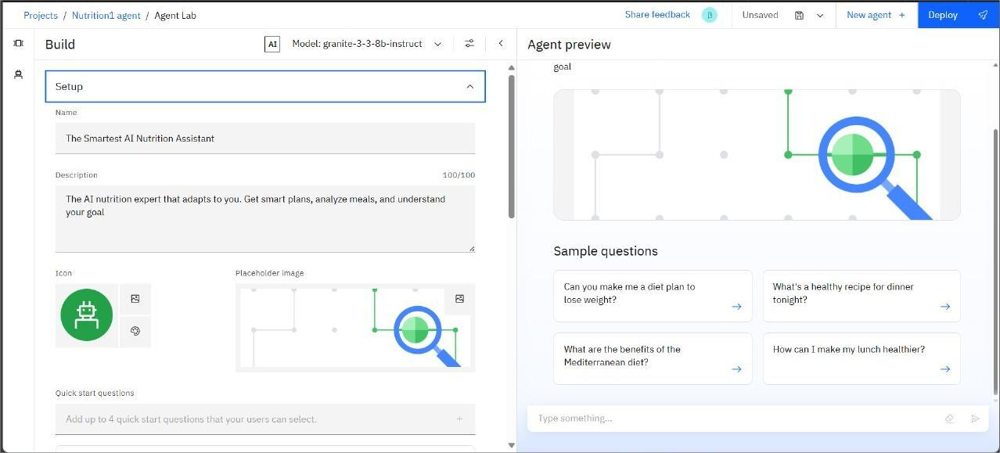

# The-Smartest-AI-Nutrition-Assistant
An AI-powered assistant designed to help users achieve their health and wellness goals with personalized, science-backed nutritional guidance. Built using IBM Watsonx.ai and Retrieval-Augmented Generation (RAG), this intelligent agent provides reliable advice on meal planning, healthy recipes, dietary needs, and more.
---

---

## 🧩 Problem Statement

In an era of information overload, many individuals struggle to find reliable and personalized nutrition advice. Generic diet plans fail to consider personal health goals, lifestyle, dietary restrictions, and cultural food habits. This leads to confusion, unsustainable habits, and failure to achieve wellness objectives like weight management or improved fitness.

---

## 💡 Proposed Solution

An AI agent trained using IBM Watsonx.ai that delivers reliable, document-based answers about nutrition. By using trusted sources like the Indian Council of Medical Research (ICMR) and the National Institute of Nutrition (NIN), and employing Retrieval-Augmented Generation (RAG), it ensures users receive grounded, easy-to-understand, and personalized nutritional guidance.

---

## 🧠 Technologies Used

- IBM Watsonx.ai Studio
- IBM Granite Foundation Model (LLM)
- Vector Index for Retrieval-Augmented Generation
- PDF documents from NIN/ICMR & other trusted health sources
- NLP (Natural Language Processing)
- IBM Cloud Object Storage

---

## ☁️ IBM Cloud Services Used

- Watsonx.ai Studio
- IBM Granite Model
- Watsonx Vector Index
- IBM Cloud Lite Account
- IBM Cloud IAM
- IBM Cloud Object Storage

---

## 👥 End Users

- Health-conscious individuals seeking wellness advice
- Fitness enthusiasts and athletes
- Individuals with dietary restrictions (e.g., diabetes, allergies)
- Users aiming for weight loss or muscle gain
- People looking for healthy recipes and meal plans
- Families wanting to adopt healthier eating habits
- Wellness coaches and dietitians

---

## 🌟 WOW Factors

- Uses RAG to fetch answers from real NIN/ICMR or uploaded dietary guideline PDFs
- Built entirely on IBM Cloud using Watsonx tools
- Handles unrelated questions with polite redirection
- Provides personalized meal plans based on user goals
- Educates users on food science, nutrients, and healthy swaps
- Offers safe and reliable nutritional guidance grounded in scientific documents

---

## 🧪 Key Features

- Document-based Q&A via Vector Index
- Powered by IBM Granite LLM for natural language understanding
- Provides personalized meal plans and recipes
- Responds gracefully to off-topic/irrelevant questions
- Covers real health concerns (weight management, dietary needs, healthy eating)

---

## 🚀 How It Works

1. User inputs a query (e.g., “Suggest a high-protein vegetarian breakfast”)
2. IBM Granite LLM processes the language
3. Vector Index retrieves trusted content from uploaded nutritional guideline PDFs
4. Agent responds with a grounded, natural-language answer and suggestions

---

## 🖼️ Screenshots
### 🔹 Setting up the Agent...

### 🔹 Configuring Agent Instructions...

### 🔹 Adding Quick Start Questions...

### 🔹 Tools Used & Initial Testing...

### 🔹 Deployment & Final Preview...

### 🔹 API References for Integration...

### 🔹 Example of a Resource List...

---

## Recordings (Watch to Build on Your Own)
▶️ [Part 1: Building the Nutrition Agent](https://youtu.be/oanWlnqpiP4)
▶️ [Part 2: Testing, Deployment, and RAG Setup](https://youtu.be/SfwFLWpIVdk)

---

## 📌 How to Run or Deploy

1. Log in to IBM Cloud Lite: https://cloud.ibm.com
2. Launch Watsonx.ai Studio
3. Create a new AI Agent
4. Upload nutritional PDFs (e.g., from ICMR, NIN) to a Vector Index
5. Choose Tools for web search (e.g., Google Search) if needed
6. Configure agent instructions to focus on nutrition and wellness topics
7. Test the agent's responses in the preview panel
8. Deploy via web snippet, Streamlit, or custom web UI

---

## 🛣️ Future Scope

- Integration with fitness trackers (e.g., smartwatches) for real-time data
- Image recognition for food logging from photos
- Speech-to-text input for hands-free queries
- Personalized grocery list generation and online ordering integration
- Multilingual expansion to support diverse user bases

---

## 🔗 Useful Links

- [IBM Cloud Lite](https://cloud.ibm.com/registration)
- [IBM Watsonx.ai](https://www.ibm.com/products/watsonx-ai)
- [National Institute of Nutrition (NIN), India](https://www.nin.res.in/)
- [ICMR Dietary Guidelines](https://www.icmr.gov.in/page/dietary-guidelines)
- [IBM SkillsBuild](https://skillsbuild.org)

---

## ⚖️ License

This project is licensed under the [MIT License](LICENSE).

---

🔗 [Connect with me on LinkedIn](https://www.linkedin.com/in/your-profile-url/)

---

> Created with 💙 during the IBM SkillsBuild for Academia Internship 2025 by **Your Name**

